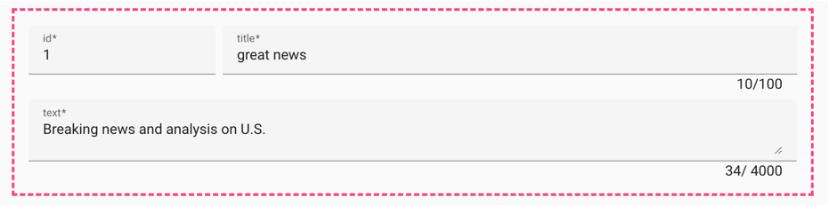
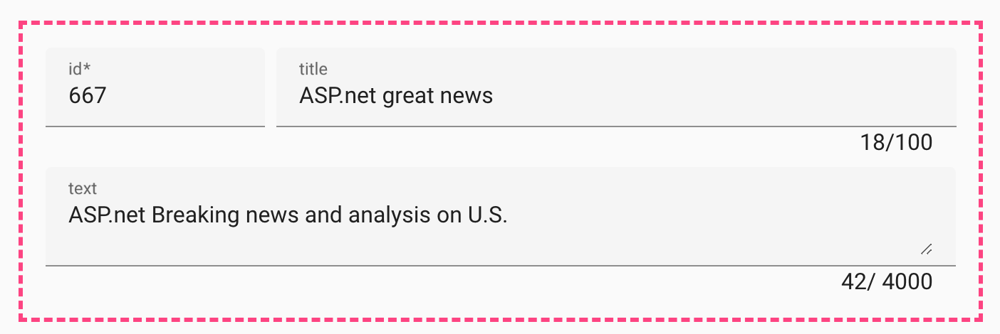

# material-formtastic

Form creation via api, no more cumbersome extension of the forms, everything is controlled via the backend. all the nice things can still be done in the angular app. all the hard work is shifted to the backend.

## how it works

In the backend, you define how the form for an object should look. The generator does the rest. Many Angular components are already supported.

## form 


Based on a 24 column css - grid

## Example ts

```ts
// the demo model
type News  = {
  id: number;
  title: string;
  text: string;
}

// the form definition
const defNews: Definition<News> = {
  id: {
    type: FormFieldType.NUMBER,
    span: 3,
    required: true,
    isPrimaryKey: true
  },
  title: {
    type: FormFieldType.STRING,
    required: true,
    maxLength: 100,
    span: 9
  },
  text: {
    type: FormFieldType.TEXT,
    required: true,
    maxLength: 4000,
    span: 12
  }
};

const news: News = {
  id: 1, 
  title: 'great news', 
  text: 'Breaking news and analysis on U.S.'
};
```




## Example asp.net

```c#

using Microsoft.AspNetCore.Mvc;

var builder = WebApplication.CreateBuilder(args);
var app = builder.Build();

app.MapGet("/api/news/{id}", ([FromRoute] int id) => Results.Json(new News(id + 666, "ASP.net great news", "ASP.net Breaking news and analysis on U.S.")));
app.MapMethods("/api/news/options/{id?}", new[] { HttpMethods.Get }, ([FromRoute] int? id) => Results.Json(new
{
  id = new FieldDefinition("number", 3, true, IsPrimaryKey: true),
  title = new FieldDefinition("string", 9, MaxLength: 100),
  text = new FieldDefinition("text", 12, MaxLength: 4000)
}));

app.Run();

public record FieldDefinition(string Type, int Span, bool? Required = null, int? MaxLength = null, bool? IsPrimaryKey = null);
public record News(int Id, string Title, string Text);


```


